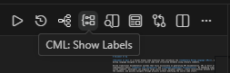
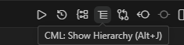
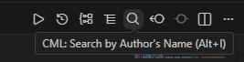
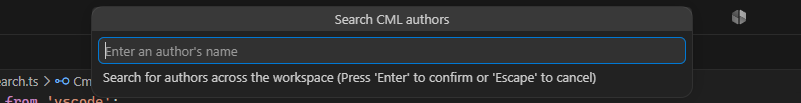
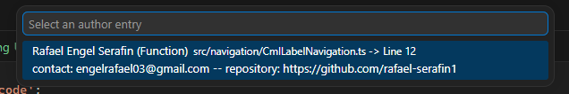

# 📃 Document It Up

Document It Up brings semantic navigation, structured documentation, and language-independent metadata to Visual Studio Code through the Commentary Markup Language (CML).

Unlike traditional documentation systems that focus exclusively on generating API documentation, CML is built around two complementary goals: **semantic code navigation** and **language-independent documentation**. By embedding simple markup tags inside comments, developers can organize large source files, document symbols, create relationships between different parts of the codebase, and quickly navigate through projects without modifying the source code itself.

Because CML is entirely comment-based, it can be adopted incrementally and used with virtually any programming language that supports comments, including C, C++, C#, Rust, Java, JavaScript, TypeScript, Python, Lua, Go, PHP, Kotlin, Swift, and many others.

## 🚀 Quick Start

Install the extension and start writing CML tags inside your comments.

```cpp
//<label>STRINGS</label>
//<desc>String manipulation utilities.</desc>

//<summary>Removes whitespace.</summary>
char* trim(char* str);
```

Open the **Labels** panel or press **Alt+K** to jump directly to the section.

## Features

### 📍 Semantic Navigation

Organize large files into logical sections using labels.

```cpp
//<label>NETWORK</label>
//<desc>Networking utilities.</desc>
```

Labels are displayed in a dedicated navigation panel, allowing you to jump directly to important sections of the current file with a single click.



or just use 'Alt + K' keybind to navigate between labels.

---

### 🌳 Hierarchy-based Tree Navigation

Organize large labels into logical subsections using children labels.

```java
//<label>NETWORK</label>
//<desc>Networking utilities.</desc>
//<span>

//<label>HTTP_REQUEST_GET</label>
//<desc>HTTP Requisiton Method GET</desc>
//<span>
{...}
//</span>


//<label>HTTP_REQUEST_POST</label>
//<desc>HTTP Requisiton Method POST</desc>
//<span>
{...}
//</span>

//</span>
```

Those are listed in a dedicated navigation panel, allowing you to jump directly to important sections of the current file with a single click.



or just use 'Alt + J' keybind to navigate between labels.

---

### 📜 Query Author's Work

Locate every symbol written by a specific developer using the `<author>` tag.

```cpp
//<author repository="https://github.com/rafael-serafin1">Rafael</author>
//<summary>Represents a database connection.</summary>
class DBConnection {
    ...
};

//<author>Rafael</author>
//<summary>Removes leading and trailing whitespace.</summary>
char* trim(char* text);

//<author>John</author>
enum ProductType {
    ...
};
```

Run the **`CML: Search by Author's Name`** (Alt + I) command and enter the author's name in the input box.

```
Current Project

> Insert Author's name

< Rafael

▼ Author's symbols

DBConnection    (CLASS)
trim            (FUNCTION)
```

The extension scans the entire workspace for CML `<author>` tags and lists every documented symbol associated with the specified author.

Selecting an item immediately opens the corresponding file and moves the cursor to the symbol declaration.

Command button on right side, above mini map.



Text box for author's name input.



Searched an author's in project.



---

### 📚 Structured Documentation

Document functions, classes, structures, variables, enumerations, namespaces, and other language constructs using semantic tags.

```cpp
//<summary>Removes leading and trailing whitespace.</summary>
//<param name="text">String to trim.</param>
//<return>The trimmed string.</return>
char* trim(char* text);
```

Documentation remains close to the code while being easy to parse and display inside the editor.

---

### 🔗 Cross References

Connect related parts of your codebase using internal or external references.

```cpp
//<see target="trim"/>
//<seealso target="#STRINGS"/>
//<see path="./string.cpp"/>
//<see url="https://en.cppreference.com"/>
```

References can point to:

* Symbols in the current file
* CML labels
* Other project files
* External documentation

---

### 📝 Rich Metadata

CML supports additional metadata that helps describe the state and usage of code.

Examples include:

* Function summaries
* Parameter descriptions
* Return values
* Notes
* Warnings
* Usage examples
* Exception documentation
* Author information
* Version information
* Platform support
* Permissions
* License information

---

### 🌍 Language Independent

CML does not depend on a compiler or language server.

Since every element is written inside comments, the same syntax can be used across different programming languages without changing the source code or requiring language-specific tooling.

---

### ⚡ Lightweight

No annotations.

No decorators.

No compiler extensions.

No preprocessing.

Everything is stored using ordinary comments, making CML portable, version-control friendly, and easy to adopt in existing projects.

---

## Why CML?

Large source files often become difficult to navigate as projects grow. Traditional documentation tools usually generate external documentation but provide limited support for navigating and organizing the source code itself.

CML addresses this by introducing semantic metadata directly into the code, allowing editors and development tools to understand the logical structure of a file without depending on the syntax of the programming language.

This makes it possible to build features such as:

* Fast navigation panels
* Rich hover documentation
* Symbol relationships
* Cross-reference links
* Documentation validation
* Static analysis
* Custom project tooling

all from a simple, human-readable markup language.

---

## Philosophy

CML is **not** intended to replace existing documentation systems such as Doxygen, Javadoc, XML Documentation, or language-specific doc comments.

Instead, it complements them by providing a consistent, extensible, and language-agnostic metadata layer that can be interpreted by IDEs, editors, documentation generators, static analyzers, and custom development tools.

The first implementation of CML is provided through the **Document It Up** extension for Visual Studio Code, with support for semantic navigation, documentation parsing, and intelligent code exploration.
